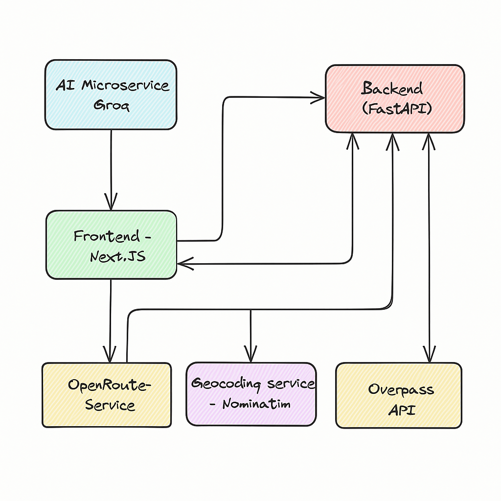
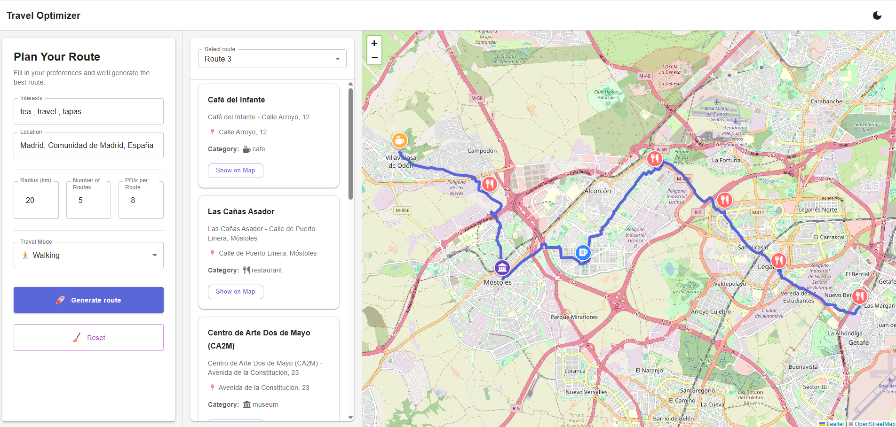
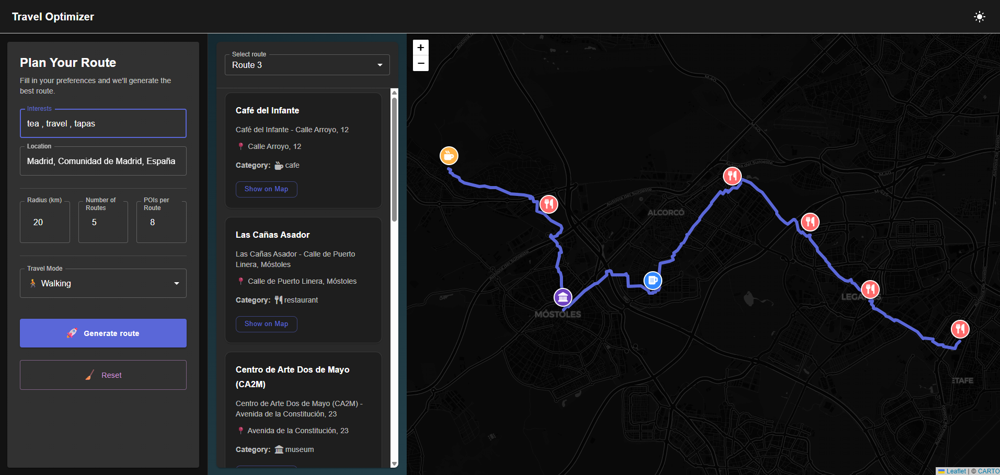

# ✈️ Travel Optimizer

An intelligent travel planning platform that suggests personalized Points of Interest (POIs) and generates optimized travel routes based on user interests and location.

---

<p align="left">
  
  
  
  
  
  
  
  
</p>

---

## 🖼️ System Diagram



---

## 🌗 UI Preview (Light & Dark Modes)





## Demo
[](https://www.youtube.com/watch?v=Y9X6yCTTJm4)
---

## 🧱 Tech Stack

- **Frontend**: React, TypeScript, Vite
- **Styling**: CSS
- **Backend**: Python, FastAPI
- **Routing & Mapping APIs**:
  - OpenStreetMap (Overpass API)
  - OpenRouteService
- **LLM Integration**: Groq API (OpenAI-compatible)
- **Infrastructure**: Docker, Docker Compose

---

## 🧭 Features

- **Personalized POI Recommendations** — Tailored suggestions based on user preferences and location
- **Optimized Route Generation** — Calculates efficient travel paths through selected POIs
- **Interactive Map Visualization** — Renders routes and POIs on an interactive map
- **Responsive UI** — Seamless user experience across desktop and mobile
- **Modular Architecture** — Clean separation between logic and presentation for easy maintenance

---

## 🧩 Key Components

- `RouteForm` — User input for travel preferences
- `RouteSelector` — Switch between multiple generated routes
- `POIList` — List of POIs with icons and categories
- `MapViewer` — Map view with markers and routes
- `RouteSidebar` — Combines selector and POI list into a panel
- `MainContent` — Contains all user-visible elements
- `MainLayout` — Overall layout structure, including header and footer
- `useRouteGenerator` — Centralized logic/state management hook

---

## 🐳 Running the Project

1. **Clone the repository:**

   ```bash
   git clone https://github.com/eranCat/docker-project-travel-optimizer.git
   cd docker-project-travel-optimizer
   ```

2. **Create a `.env` file under the `backend/` directory with:**

   ```env
   GROQ_API_KEY=your-groq-api-key
   ORS_API_KEY=your-openrouteservice-api-key
   ```

3. **Start the services:**
   ```bash
   docker compose up --build
   ```

4. **Access the application:**

   - Backend API Docs → http://localhost:8000/docs  
   - Frontend Application → http://localhost:5173


## 🔐 How to Get API Keys

### 📘 How to Get a Groq API Key

1. Visit [https://console.groq.com/keys](https://console.groq.com/keys)
2. Sign in or create an account
3. Navigate to **API Keys**
4. Click **Create New Key** and copy it

> ⚠️ Groq provides OpenAI-compatible endpoints for LLM-based processing (used for POI tag suggestions).

### 🗺️ How to Get an OpenRouteService API Key

1. Go to [https://openrouteservice.org/dev/#/signup](https://openrouteservice.org/dev/#/signup)
2. Register and log in
3. Under the **API Keys** section, create a new key
4. Use it as your `ORS_API_KEY`

> 🔑 OpenRouteService is used to calculate real-world routes and travel distances.

---

## 🧪 Development

### Frontend

```bash
cd frontend
npm install
npm run dev
```

### Backend

```bash
cd backend
pip install -r requirements.txt
uvicorn main:app --reload
```

## 🧪 Running Unit Tests in Docker

To run all unit tests using Docker:

```bash
docker compose run tests
```

This will:

* Run all test files under `tests`

You should see output like:

```
======================= test session starts =======================
platform linux -- Python 3.9.22, pytest-8.3.5, pluggy-1.6.0 -- /usr/local/bin/python3.9
cachedir: .pytest_cache
rootdir: /app
plugins: anyio-4.9.0
collected 5 items                                                                                                                                                                                              

test_backend.py::test_autocomplete PASSED [ 20%]
test_llm_service.py::test_generate_tags_from_llm PASSED [ 40%]
test_maps_service.py::test_maps_geocode PASSED [ 60%]
test_maps_service.py::test_maps_pois PASSED [ 80%]
test_maps_service.py::test_maps_routes PASSED [100%]

======================= 5 passed in 5.23s =======================
```

---

## 📡 API Responsibilities

The FastAPI backend is responsible for:

- **LLM-driven POI Tag Matching**  
  Converts free-form interests (e.g. "vegan food, art, historic places") into structured POI tags using the Groq language model API.

- **Geocoding Location**  
  Translates user-input location (like "Tel Aviv") into geographic coordinates using OpenStreetMap’s Nominatim API.

- **POI Discovery with Overpass API**  
  Queries real-world POIs around the selected location using the Overpass API, filtered by LLM tags.

- **Route Optimization**  
  Connects POIs into optimized paths based on user settings (number of routes, travel mode, etc.) using OpenRouteService.

- **Live Progress Feedback (SSE)**  
  Uses Server-Sent Events (SSE) to stream backend progress stages (`Converting interests`, `Fetching POIs`, etc.) live to the frontend.

- **Caching & Storage**  
  Persists generated routes temporarily for retrieval and display after processing.

- **Error Reporting and Suggestions**  
  Returns structured error messages with optional suggestions (e.g. "Try increasing your search radius").

---