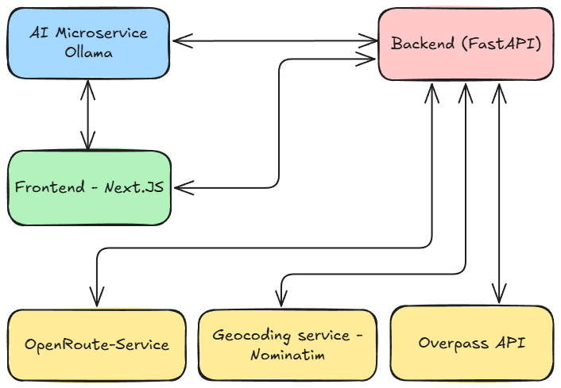

# 🗺️ Travel Optimizer Backend

A modular backend system for personalized travel route optimization using AI and real-world POI data. Built with FastAPI, Docker, and Ollama (LLM), this project delivers optimized travel routes based on user interests and geolocation.

---

## 📦 Tech Stack

- **Python 3.10+**
- **FastAPI** - high-performance API framework
- **Ollama LLM** - smart POI interest matching
- **OpenStreetMap + Overpass API** - real POI data
- **Docker Compose** - for orchestration
- **Pytest** - test suite

---

## 🧠 Features

- 🔍 Match POIs based on user interests (via LLM)
- 📍 Geocode natural-language locations into coordinates
- 🧭 Generate shortest routes between POIs
- 🧰 Testable endpoints and services
- 📦 Dockerized setup for portability
- 📄 Structured Pydantic schemas

---

## 🗺️ Architecture

<div align="center">
  
</div>

---

## 🚀 Getting Started

### 1. Clone the repo

```bash
git clone https://github.com/EASS-HIT-PART-A-2025-CLASS-VII/docker-project-travel-optimizer.git
cd docker-project-travel-optimizer
```

### 2. Configure Environment Variables

Create a `.env` file with the following:

```env
OLLAMA_URL=http://ollama:11434
```

### 3. Run the App

```bash
docker-compose up --build
```

App will be available at `http://localhost:8000/docs`

---

## 🧪 Running Tests

```bash
docker exec -it travel-backend python run_tests.py
```

---

## 📬 API Endpoints

| Endpoint | Description |
|----------|-------------|
| `POST /match-pois-llm` | Match POIs using LLM based on interests |
| `POST /routes/generate-paths` | Generate optimal route with selected POIs |
| `GET /docs` | Interactive Swagger UI |

---

## 🌍 Example Request
```POST /routes/generate-paths```
```json
{
  "interests": "yoga, shows, italian food",
  "location": "tel aviv",
  "radius_km": 2,
  "num_routes": 3,
  "num_pois": 5
}
```

---

## ✨ Credits

Created as part of the Docker Engineering Project at EASS HIT Class VII (2025).