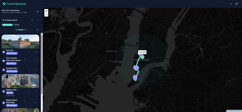
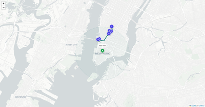
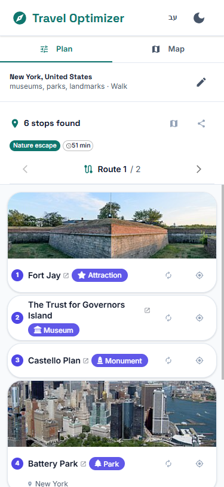
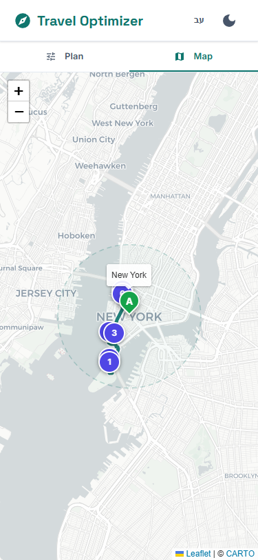

# Travel Optimizer

A fullstack app that generates optimized multi-stop travel itineraries using LLM-suggested OpenStreetMap tags and real-world routing from OpenRouteService.

> **Why a monolith?** The backend serves the prebuilt React frontend from a single port, so the whole app runs as **one** service instead of two. This is deliberate: Render's free tier bills per service, and a second always-on web service would cost money — bundling frontend + backend keeps the deploy free. A Docker/microservices variant exists for setups where the split is worth paying for.

## Screenshots

### Desktop



*Walking route through Lower Manhattan from "museums, parks, landmarks" — form on left, POI list, route variants, live map.*



*Route 2 in light mode — numbered stops across Manhattan with Washington Square Park, Yeshiva University Museum, and Battery Park.*

### Mobile

<div style="display: flex; gap: 1rem;">
  <figure>
    
    <figcaption><em>Plan tab — POI cards on tap.</em></figcaption>
  </figure>
  <figure>
    
    <figcaption><em>Map tab — full-screen interactive route.</em></figcaption>
  </figure>
</div>

## Features

- **Intelligent POI discovery** — interests free-text → Groq LLM → OSM tags → Overpass API
- **Optimized routes** — greedy one-POI-per-category builder + 2-opt improvement, multiple route variants
- **POI quality filtering** — removes non-tourist venues (errands, infrastructure), permanently closed places, name-pattern blocklist (cemeteries, shelters)
- **Rich POI cards** — opening hours, wheelchair accessibility badge, category chips, direct Google/OSM search links
- **Route metadata** — walk/drive/cycle duration from ORS, vibe label per route
- **Export & share** — open route in Google Maps, copy shareable URL (form state encoded in query params)
- **Surprise Me** — randomize interests with one click
- **Time-of-day biasing** — morning/evening/night hints adjust which POI types Groq suggests
- **Wheelchair filter** — Overpass `wheelchair=yes/limited` query constraint
- **Dark mode** — MUI theme toggle
- **Per-IP rate limiting** — 5 route-generation requests/60 s

## Tech Stack

| Layer    | Technology |
|----------|------------|
| Frontend | React 18, TypeScript, Vite, MUI, Leaflet (react-leaflet) |
| Backend  | FastAPI (Python), SSE streaming |
| LLM      | Groq (OpenAI-compatible) — converts free-text interests to OSM tags |
| Maps     | Overpass API (POIs), OpenRouteService (routing geometry + duration), Nominatim (geocoding) |

## Architecture

```
┌─────────────┐         ┌──────────────────────────────────────┐
│  React UI   │ ──HTTP─▶│  FastAPI backend                     │
│  (Vite)     │         │  ├─ GET /autocomplete (Nominatim)    │
└─────────────┘         │  ├─ GET /route-progress  (SSE)       │
                        │  │   ├─ Groq → OSM tags              │
                        │  │   ├─ Overpass → filter → POIs     │
                        │  │   └─ ORS → optimized routes       │
                        │  ├─ GET /get-latest-routes/{id}      │
                        │  └─ POST /frontend-log               │
                        └──────────────────────────────────────┘
```

SSE stream emits `stage` events (progress) then a `complete` event carrying a `route_id`. The frontend fetches the full result from `/get-latest-routes/{id}`.

## Getting Started

### Prerequisites
- Python 3.10+
- Node.js 18+
- [Groq API key](https://console.groq.com)
- [OpenRouteService API key](https://openrouteservice.org)

### Setup

```bash
git clone https://github.com/eranCat/docker-project-travel-optimizer.git
cd docker-project-travel-optimizer
git checkout monolith
```

#### Backend (terminal 1)

```bash
cd backend
cp .env.example .env        # fill in GROQ_API_KEY and ORS_API_KEY
python -m venv .venv
.venv\Scripts\Activate.ps1  # Windows PowerShell
# source .venv/bin/activate # macOS/Linux
pip install -r requirements.txt
uvicorn main:app --reload --port 8000
```

Health check: `GET http://localhost:8000/health` → `{"status":"ok"}`

#### Frontend (terminal 2)

```bash
cd frontend
npm install
npm run dev        # http://localhost:5173
```

### Environment Variables

`backend/.env`:
```env
GROQ_API_KEY=your_groq_key_here
ORS_API_KEY=your_openrouteservice_key_here
# Optional:
# OVERPASS_API_URL=https://overpass.kumi.systems/api/interpreter
```

`frontend/.env`:
```env
VITE_API_BASE_URL=http://localhost:8000
```

## Project Structure

```
backend/
  main.py                   # FastAPI app, middleware, logging
  config.py                 # pydantic-settings (reads .env)
  requirements.txt
  models/                   # Pydantic models
  routers/                  # route-progress SSE, autocomplete, health
  services/
    llm/                    # Groq client — interests → OSM tags
    maps/                   # Overpass POI fetch, ORS routing, geocoding
    generate_optimized_routes.py
  utils/
  tests/
frontend/
  src/
    components/             # React components
    hooks/                  # useRouteGenerator (all app state + SSE)
    models/                 # TypeScript interfaces
    services/               # API client (SSE + fetch)
    styles/                 # Category icons/colors
    utils/
```

## Tests

Integration tests require a running backend:

```bash
cd backend
uvicorn main:app --port 8000   # terminal 1
pytest                          # terminal 2
```

## Deployment

Deployed on [Render](https://render.com) as a **single web service** — the FastAPI backend serves the pre-built React app, so one URL covers both frontend and backend (port 8000). Config lives in `render.yaml`.

Live: `https://docker-project-travel-optimizer.onrender.com`

### Keepalive

Render's free tier **spins a service down after 15 minutes of inactivity**, adding a cold-start delay (~30–60 s) to the next request. The GitHub Actions workflow `.github/workflows/keepalive.yml` pings `/health` every 10 minutes to keep the single service (and therefore both frontend and backend) warm:

```yaml
on:
  schedule:
    - cron: '*/10 * * * *'   # 5-min margin under the 15-min idle limit
  workflow_dispatch:          # manual trigger for testing
```

Notes:
- One `/health` ping keeps the whole service alive — there is no separate frontend service to ping.
- GitHub-scheduled crons are **best-effort**: ticks can be delayed several minutes or dropped entirely under load, so this is not a hard uptime guarantee. For reliable warming use an external pinger (e.g. UptimeRobot, cron-job.org) hitting `/health` every 5 minutes.
- Keepalive only prevents idle-sleep; it does not affect Render's monthly free instance-hour cap or cold restarts on deploy.

## Author

**Eran Karaso** — [Portfolio](https://erancat.github.io/portfolio-site) · [GitHub](https://github.com/eranCat)
