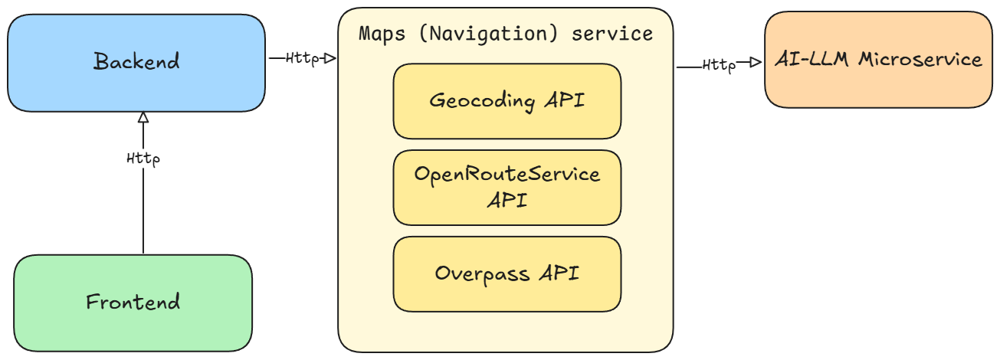

# 📄 Travel Optimizer ✈️

<p align="center">
  <p align="left">
  
  
  
  
  
  
  
  
</p>

</p>

> An intelligent travel planning platform that suggests personalized Points of Interest (POIs) and generates optimized travel routes based on user interests and location.

---

📊 System Diagram:
------------------


---

🚀 Tech Stack
-------------

- **Frontend**: TypeScript, React, Vite
- **Styling**: CSS
- **Backend**: Python, FastAPI
- **Routing and Mapping APIs**: OpenStreetMap (Overpass API), OpenRouteService
- **LLM Integration**: Groq API (using OpenAI-compatible client)
- **Infrastructure**: Docker, Docker Compose
- **Other**: HTML for structure and minor frontend parts

---

## 🛠 Architecture Overview

- **Frontend**  
  Built with React and Vite, providing a dynamic and responsive interface.  
  Allows users to input free-form interests and location, view suggested POIs, and visualize optimized routes on an interactive map.

- **Backend**  
  Powered by FastAPI.  
  Handles POI suggestion, routing, and geocoding:
  - **Interest Matching**: Integrates with Groq's LLM to translate user interests into valid OpenStreetMap tags.
  - **POI Discovery**: Fetches real-time POIs from Overpass API around the selected location.
  - **Route Optimization**: Calculates efficient travel paths using OpenRouteService API.

- **LLM Prompting Strategy**  
  The backend sends a predefined list of OpenStreetMap tags to Groq, ensuring valid and safe matching results without hallucinations.

- **Stateless Design**  
  No database is used. All data processing happens live per request, ensuring lightweight deployment and fast responses.

---

## 🧩 System Components

| Component | Description |
|:---|:---|
| **Frontend** | React app served on port `5173`, communicating with the backend |
| **Backend** | FastAPI app exposed on port `8000` |
| **Groq API** | Used for intelligent interest-to-tag matching |
| **Overpass API** | Used for live POI retrieval from OpenStreetMap |
| **OpenRouteService API** | Used for generating optimal travel routes between selected POIs |

---

## 🐳 Running the Project

1. **Clone the repository:**
   ```bash
   git clone https://github.com/eranCat/docker-project-travel-optimizer.git
   cd docker-project-travel-optimizer
   ```

2. **Create a `.env` file under the `backend/` directory with:**
   ```bash
   GROQ_API_KEY=your-groq-api-key
   ORS_API_KEY=your-openrouteservice-api-key
   ```

3. **Start the services:**
   ```bash
   docker compose up --build
   ```

4. **Access the application:**
   - Backend API Docs → http://localhost:8000/docs
   - Frontend Application → http://localhost:5173/

---

## 🌎 API Responsibilities

| Endpoint | Description |
|:---|:---|
| `POST /routes/generate-paths` | Receives user interests and location; returns optimized travel paths with selected POIs |
| `GET /autocomplete` | Autocompletes location queries using OpenStreetMap's Nominatim service |
| `GET /health` | Health check endpoint for Docker and deployment validation |

---

## ✨ Highlights

- 🔎 **Interest-Based Personalization**  
  Using a hosted LLM to understand and match human interests to OpenStreetMap categories.
  
- 🗺️ **Real-Time POI Discovery**  
  No outdated databases — POIs are always pulled live from OpenStreetMap based on user location.

- 🚗 **Optimized Travel Routes**  
  Routes are computed with real walking/driving distances using OpenRouteService, not simple straight lines.

- 🧠 **Efficient and Clean Architecture**  
  Backend and frontend are completely separated, containerized, and environment-driven.

---

> Designed for speed, modularity, and real-world intelligent trip planning.  
> Built with ❤️ for travelers who love optimized experiences.

---